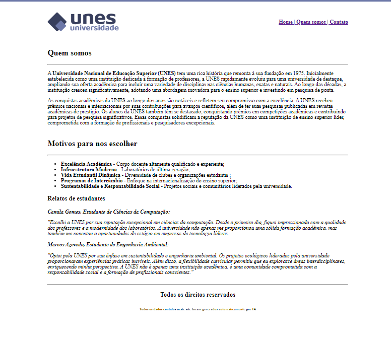
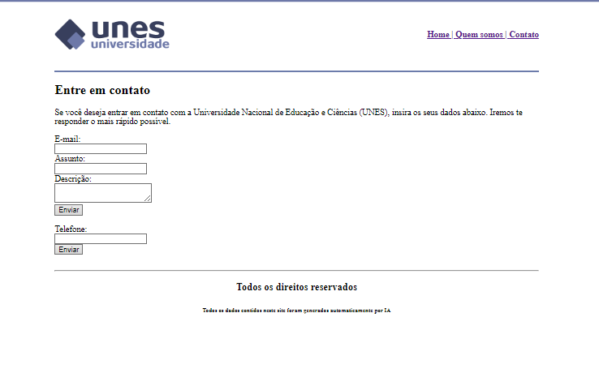

<!DOCTYPE html>
<html lang="en">
<head>
    <meta charset="UTF-8">
</head>
<body>
    <h2>Website de universidade fictícia (UNES) <em>(Fictitious university website)</em></h2> 
    <em>Last update: January 16th, 2024</em>  
     
     
     
    
</body>
</html>